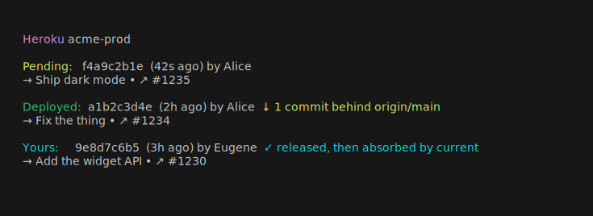

<p align="center">
  
</p>

<div align="center">

### See what's on air — which commit is actually running in production.

[](https://rubygems.org/gems/onair)
[](https://github.com/amberpixels/onair/actions/workflows/ci.yml)
[](LICENSE.txt)

</div>

---

<p align="center">
  
</p>

`onair` answers one question fast and truthfully. The deployed commit comes
from the running release's *slug*, never from "newest build" — after a
rollback those differ, and the whole point of this tool is to not lie in that
case.

## Principles

1. **Truth over convenience.** What's *running*, not what was built last.
2. **Zero runtime dependencies.** Ruby stdlib only.
3. **Read-only.** Never deploys, never rolls back, never writes to git except
   an explicit lazy `git fetch`.
4. **Platform-agnostic core.** Heroku is the first adapter, not the
   architecture.
5. **Degrade gracefully.** Offline, missing commits, no color support — every
   failure mode renders something useful, never a stack trace.

## Installation

```sh
gem install onair
```

Requires Ruby >= 3.2. Auth reuses the Heroku CLI's token from `~/.netrc`
(written by `heroku login`), falling back to `heroku auth:token`.

## Usage

```
onair              # status report for the current repo
onair init         # write .onair.yml; --justfile appends a `prod` recipe
onair --json       # machine-readable status
onair --app NAME   # override the app for one invocation
onair --no-fetch   # never fetch git objects from the remote
```

Exit codes: `0` success, `1` operational error. Color is disabled when stdout
is not a TTY or `NO_COLOR` is set.

### Speed

The remote head of `origin/<branch>` is resolved through the GitHub API
(~0.4s) when a token is ambient — `GH_TOKEN`, `GITHUB_TOKEN`, or a logged-in
`gh` CLI — with `git ls-remote` always racing alongside as the fallback
(no token, non-GitHub remote, API failure). Both report the live remote ref;
the API is a faster transport, never a cache.

### What the report shows

- **Deployed** — the commit the running release was built from, its age,
  author, and a delta against `origin/main`: `★ current` or
  `↓ N commits behind`. If the relationship is unknown (diverged history,
  commits unavailable), no marker is shown — silence over speculation.
- **Pending** — an in-flight build that's about to replace the deploy.
- **⏸ pinned** — a newer build succeeded but is *not* what's running
  (rollback / pinned release).
- **Yours** — when someone else's commit is deployed but yours sits just
  below it: your merge made it to prod, absorbed by a later deploy.

## Configuration

`.onair.yml` (searched upward from the working directory to the git root):

```yaml
platform: heroku
app: acme-prod
repo: acme/widgets   # for PR/commit links; default: inferred from origin
branch: main         # comparison branch; default: main
```

Resolution order: CLI flags → env vars (`HEROKU_APP`, `GITHUB_REPO`) →
`.onair.yml`.

### Task links (optional)

If your commit subjects carry task ids (Jira, Linear, Notion, anything), tell
onair how to recognize and link them:

```yaml
task:
  pattern: 'ABC-\d+'                              # any Ruby regex
  url: 'https://acme.atlassian.net/browse/{task}' # {task} = the matched id
```

Matched ids in commit subjects become clickable terminal hyperlinks (the text
stays identical), and `--json` gains a `task` object (`{ "id", "url" }`) per
commit. No `task:` section — no behavior, nothing to opt out of.

## JSON schema

`onair --json` emits one object; the schema is a public API and only changes
additively:

```json
{
  "app": "acme-prod",
  "platform": "heroku",
  "branch": "main",
  "repo": "acme/widgets",
  "remote_head": "<sha>",
  "deployed": {
    "sha": "<sha>", "version": 1234, "description": "Deploy a1b2c3d4",
    "deployed_at": "2026-06-12T10:00:00Z", "subject": "Fix the thing (#1234)",
    "author": "Eugene", "task": null
  },
  "pending": null,
  "delta": { "status": "current", "behind_by": 0 },
  "pinned": null,
  "yours": null
}
```

- `delta.status` is `"current"`, `"behind"`, or `"unknown"`.
- `pending`: `{ "sha", "started_at", "subject", "author" }` when a build is
  in flight.
- `pinned`: `{ "version", "description", "latest_built_sha" }` when a newer
  build succeeded but is not running.
- `yours`: `{ "sha", "had_own_build", "subject", "author" }` when your commit
  sits just below the deployed head.
- `subject`/`author` are `null` when the commit isn't in the local repo.
- `task`: `{ "id", "url" }` when a `task:` matcher is configured and the
  subject contains a match, otherwise `null`.

## Development

```sh
bundle install
bundle exec rake        # specs + rubocop
```

The behavioral source of truth is `reference/prod-release.sh`, the
battle-tested bash script this gem was extracted from. The behavior spec in
`spec/onair/report_spec.rb` ports its rules one by one.

## License

MIT
